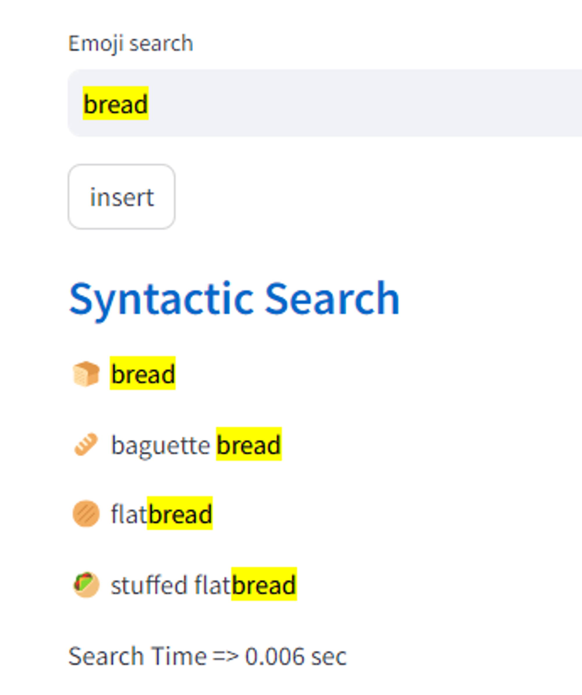
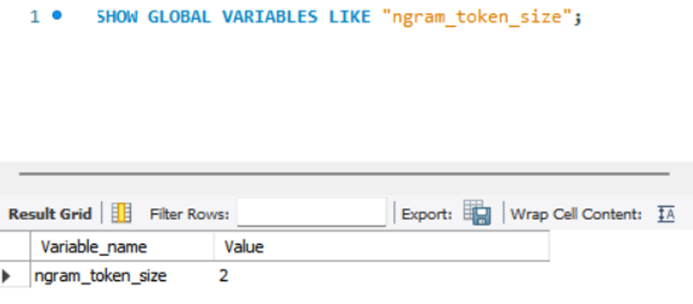
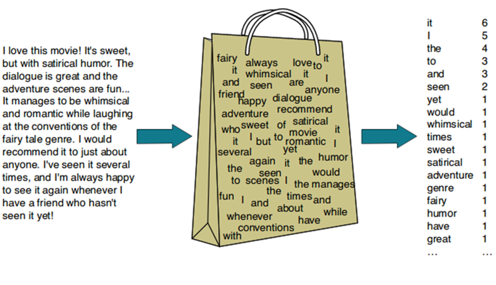
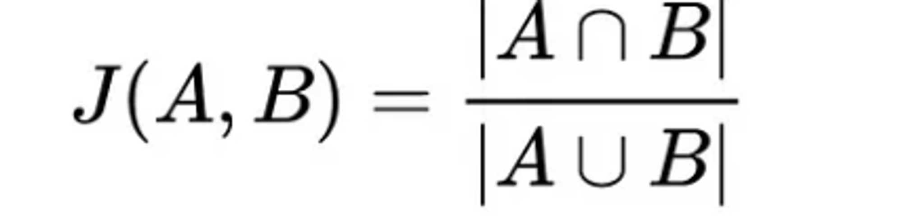
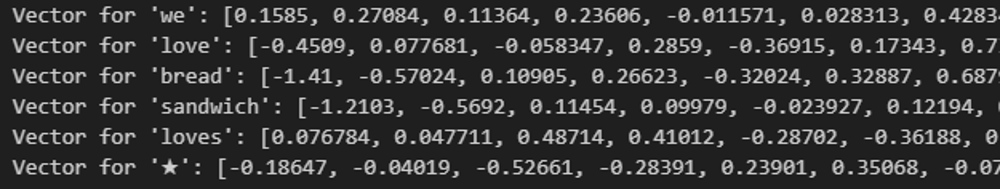

## 벡터 인덱스와 유사도를 이용해서 이모지(Emoji) 시맨틱 검색 기능 구현하기

이 글에서는 텍스트(자연어) 데이터의 색인(Index) 방식과 활용 방법에 대해서 기술적으로 설명합니다. 개별적인 텍스트 데이터의 색인 방법인 n-gram의 구체적인 작동 방식을 심도 있게 설명하거나, 자연어 처리(NLP)에 대해 구현(implementation) 관점의 상세한 설명은 이야기하려고 하는 핵심 주제가 아닙니다.

때문에, 자연어 검색 시스템을 전반적으로 이해를 목적으로 하거나, 벡터 유사도(Vector Similarity)를 이용한 시맨틱 검색(Semantic Search)에  관심이 있는 소프트웨어 엔지니어 분들이 읽어보시고 의견을 나누어 보면 좋겠습니다.

데이터 관리를 위한 시스템의 공통적인 요구사항 중 하나는 검색 기능입니다. 일반적인 사용자는 특별한 시스템이 아니더라도 자연어로 작성한 키워드를 입력하고 적절한 결과가 제공될 것으로 기대합니다. 기술적으로 이러한 강력한 성능의 검색 성능에 부합하는 소프트웨어 기능을 직접 구현하는 것은 쉬운 일이 아닙니다.

### 키워드로 이모지 검색하기

메신저나 이메일을 작성할 때 이모지(emoji)의 활용 빈도는 점점 늘어나는 듯 보입니다. 경험적으로도 실용적으로 메시지의 내용을 간결하게 유지 하면서도 뉘앙스를 함께 전달하기 위해서 매우 유용한 커뮤니케이션 도구 중 하나라고 생각합니다.

하지만 상황에 맞는 적절한 이모지를 이용하는 것은 여간 쉬운 일이 아닙니다.  Window에서 기본적인 이모지 검색을 지원하고 있지만 해당 검색 시스템을 이용해 원하는 이모지를 찾을 수 있는 확률이 상대적으로 낮기 때문에 주로 사용했던 것들만 사용하게 됩니다.

*실제 Window 이모지에서 케이크를 검색한 결과. 🎂(생일케이크)는 보이지 않는다.*

이러한 이모지 검색이 직관적으로 보여질 수 있는 좋은 사례로 생각되어 이번 검색 기능 구현의 사용 데이터로 설정하였습니다. 

### 기본적인 Synthetic Search (Keyword Search)

검색 시스템 중 가장 고전적인 방법인 입력된 단어가 포함된 결과를 모두 보여주는 것을 Synthetic Search, Keyword Search라 부르고, 대표적인 방법으로는 N-Gram이 있습니다.

*n-gram을 이용한 Synthetic Search 결과 1*

*n-gram을 이용한 Synthetic Search 결과 2 | ‘cak’ 까지만 입력해도 cake가 검색된 것을 볼 수 있다.*

n-gram에서 n은 숫자를 의미하며 문자열에서 n개의 연속적인 요소를 잘라서 Index로 사용하는 방법입니다(그래서 n을 n-gram token size 라고도 합니다).  예를들어 “DATA”를 n=2인 Bi-gram으로 적용하면, 인덱스는 “DA”, “AT”, “TA”가 생성됩니다. 

*n-gram “data” 예시*
*MySQL에서 n-gram token 수를 확인하는 쿼리. Default는 2이다.*

한글로 적용하면 “데이터” 에서 “데이”, “이터” 라는 인덱스가 생성됩니다. 

이렇게 n-gram을 사용한 full-text search를 하게 되면, 전문에서 부분적으로 인덱스를 가지게 되어 검색의 정확도가 상승하게 됩니다. “아메리카노”를 검색하기 위해서 “아메”라고만 넣어도 “아메리카노”가 나오니까요(물론 “아메”가 포함된 “아메리카” 같은 다른 단어들도 나옵니다). 이를 정렬하는 방법은 관련성 점수, 검색 옵션에 따라서 달라집니다. 특히 한국어, 중국어, 일본어의 경우 단어+단어 조합으로 새로운 문자를 만들 수 있기 때문에 n-gram을 사용하면 검색의 정확도가 더욱 올라갈 수 있습니다. 

하지만 n-gram이 무조건 좋은 것은 아닙니다. 검색 결과에서 누락이 발생할 확률이 적다는 장점이 있지만, 인덱스가 늘어남에 따라 DB 용량이 증가한다는 단점 또한 가지고 있기에 상황에 맞춰 적절한 token size(=n) 설정이 필요합니다.

### 한걸음 나아간 Semantic Search

그렇다면 모든 검색 시스템을 확실한 n-gram으로 만들어야 할까요? 사랑을 입력했을 때, 하트가 나오고 연인의 모습이 나온다면 어떨까요? ‘이런 것도 나오네?’ 하면서 유저의 검색 만족도가 올라가지 않을까요? 또 케이크를 입력했을 때, 촛불, 풍선 같은 이모지들이 같이 나온다면요?

이렇게 텍스트 자체가 아닌, 그 검색어가 가지고 있는 의미에 기반해서 검색 결과를 보여주는 것이 바로 **Semantic Search** 입니다. 0과 1밖에 모르는 컴퓨터가 어떻게 우리가 사용하는 단어의 의미를 이해하고 관련 결과를 보여줄 수 있는 걸까요? 

그건 바로 **데이터의 Vector화**와 **유사도 검색(Similarity Search)**에 달려있습니다. 데이터를 다차원의 공간 속 벡터로 표현하고 해당 벡터와 유사한 벡터를 찾음으로 효율적인 데이터 검색을 진행하며, 이는 곧 사용자의 검색 만족도를 높여줍니다. 유사한 벡터는 다차원의 공간에서 유사한 위치에 존재하기에 다른 말로 ‘최인접 이웃 검색(Nearest Neighbor Search)’이라고도 합니다. 이런 방법은 문서 검색뿐만 아니라 추천시스템, 머신러닝, 컴퓨터비전 등 다양한 곳에서 사용됩니다.  

앞서 n-gram이 단어를 n개의 연속된 단어로 쪼개서 인덱스로 설정해 검색했다면, Semantic Search는 데이터를 다차원의 Vector로 만든 Vetor값([12.23, 456.789, …])을 인덱스로 설정해 검색을 진행합니다.

*“Sandwich”를 검색했을 때 보여지는 Keyword Search와 Vector Search의 결과 차이*

### Word to Vector

단어를 벡터로 수치화하려면 어떻게 해야할까요? 데이터 벡터화 중 텍스트데이터인 단어를 고정된 사이즈의 벡터로 변환하는 ‘단어 임베딩(Word Embedding)’ 방법과 그를 통해 유사도를 측정하는 방법을 알아보겠습니다.

*문장수집 → 토큰화의 단계[^1]*

1. **문장수집**

: 원하는 대상에서 텍스트 데이터를 수집하는 단계입니다. 이는 자연어 처리를 위한 첫번째 단계로 특정 목적을 가진 텍스트들을 모읍니다. 대부분 웹크롤링이나 ebook 데이터를 사용합니다. 이 단계는 벡터화의 시작점으로 양질의 데이터를 모으는 것이 중요합니다. 좋은 재료로 요리해야 맛있는 음식이 나오는 것 처럼 Input 데이터가 좋아야 Output 또한 좋은 결과가 나오기 때문입니다. 그리고 이렇게 자연언어 연구를 위해 특정한 목적을 가지고 언어의 표본을 추출한 것을 코퍼스(Corpus)라고 합니다. 

2. **텍스트 전처리 및 토큰화(Tokenization)**

: 수집한 텍스트에서 불필요한 정보를 제거하거나 바꿔주는 전처리를 거칩니다. 이때, 크롤링할 때 노이즈로 들어오는 html 태그 내용(br, a,…)을 삭제하거나, 대문자를 소문자로 통합하거나 특수문자들을 제거하는 등의 과정이 들어갑니다. 그리고 의미있는 단어(Token)를 기준으로 자르는 작업(Word Tokenization)을 진행합니다. 가장 쉬운 방법으로는  I love data → i, love, data 처럼 구분 기호/띄어쓰기 기준으로 나누는 방법이 있습니다. 하지만 단어 토큰화를 진행할 때엔 고려해야할 사항이 많으므로 상황에 맞춰 전처리 및 토큰화를 진행하는 것이 좋습니다. 예를들어 한국어는 띄어쓰기 기준으로 하면 ‘데이터가 좋아’ → ‘데이터가’, ‘좋아’ 처럼 실질적 의미인 ‘데이터’와 접미사 ‘-가’가 함께 쓰이는 교착어이기 때문에 형태소 분석을 통한 토큰화가 더 유리합니다. 

3. **단어 임베딩(Word Embedding)**

: 모든 텍스트를 토큰화 한 후, 각 단어를 고정된 크기의 실수 벡터로 변경하는 단계입니다. 주로 Word2Vec이나 GloVe FastText 같은 단어 임베딩 기법을 사용하며 단어를 벡터로 변형하여 
은 단어 또는 문서를 벡터로 변환하여 의미론적 뜻(semantic meaning)에 따라 유사한 문서 또는 단어를 효율적으로 검색할 수 있습니다.

4. **유사도 구하기**

: 이제 모든 단어(혹은 문장)은 일정 차원을 가진 벡터로 변경되었습니다. 그렇다면 이제 벡터들 간의 유사도를 구함으로 비슷한 의미를 가진 단어인지 확인하는 순서만 남았습니다. 
이런 벡터간 유사도를 구하기 위해 사용되는 방법은 주로 코사인 유사도(Cosine similarity), 유클리디안 거리(Euclidean distance), 자카드 유사도(Jaccard similarity) 3가지가 사용됩니다. 각각의 방법에대해 간단히 소개하겠습니다.

 - **코사인 유사도(Cosine similarity)**

두 벡터사이의 내각를 측정하여 유사도를 측정하는 방법입니다. 백터의 방향이 비슷할 수록(cosθ= 1) 두 벡터는 유사하다고 할 수 있으며, 반대로 직각(cosθ= 0)을 이룰 때에 두 벡터는 유사성이 없음을 의미합니다. Cosθ의 값은 `-1~1` 사이의 값을 갖지만 자연어 처리의 경우A, B 피쳐 벡터 행렬은 보통 단어 빈도(tf-idf 가중치)로 측정되어 음수값이 없으므로 코사인 유사도는 `0~1` 사이의 값을 갖게 됩니다. 
그리고 자연어는 고차원의 벡터를 사용하게 되는데, 코사인 유사도의 경우 벡터 차원수의 영향을 덜 받고, 단어의 다양성으로 발생하는 단어 희소성(sparsity)의 문제에도 민감하지 않기 때문에 자연어 부분에서 유사도를 측정할 때 Cos유사도를 많이 사용하고 있습니다.

*Cos유사도 수식 (출처 : Wiki백과[^2])*
*3 단어를 2D의 공간 상에 표시한 예시  출처 : (출처 : Digital begriffsgeschichte: Tracing semantic change using word embeddings) [^3])*

- *유클리디안 거리(Euclidean distance) :* 

두 벡터간의 직선 거리를 계산하여 유사성을 평가하는 방법으로 두 벡터간의 거리가 작을 수록 더 유사하다고 평가 할 수 있습니다. 하지만 다차원의 공간에서 거리를 측정하게 되면 각 데이터들의 유사도가 보존되지 못한다는 단점이 있습니다. 이를 보완하기 위해서 차원을 축소시키는 방법도 있으나 많은 연산을 필요로 합니다.

*Euclidean distance (출처 : Deep Dive: How do Vector Databases Work[^4])*
*Euclidean distance는 동일하지만 유사도가 다른 벡터의 경우 (출처 : Deep Dive: How do Vector Databases Work[^4])*

- 자카드 유사도 (Jaccard Similarity) : 

집합에 대한 유사성을 측정하는 방법으로, 자연어 처리의 경우 두 집합(Token)의 공통된 원소의 비율을 측정하여 0~1사이의 값으로 유사도를 나타냅니다.  이는 단어의 순서나 길이, 의미를 무시하고 단순 단어 비교만 진행하기 때문에 정확한 유사성을 판단하지 못한다는 단점이 있습니다. 

*Jaccard Similarity 수식*

### Example Architectur for Semantic Search

Github에 있는 예시를 참고하여 Vector를 이용한 Semantic Search를 구현하였습니다. 먼저, 효과적인 작업 진행을 위해 직접 문장을 수집하고 전처리, 단어 임베딩하지 않고, Pre-trained  Vecrtor를 사용했습니다. 사용한 Pre-trained  Vector는 Tweeter(현 X) 데이터를 Corpus로 사용하여 [GloVe](https://github.com/stanfordnlp/GloVe)라는 Word Embedding방법으로 2B tweets을 27B의 token으로 나눠 Embedding한 Vector 데이터입니다. 

*glove.twitter.27B.200d.txt의 일부분으로 단어와 특수문자들에 200demansion의 vector가 부여되어 있다. *

위처럼 동일한 Word Embedding model의 Pre-trained Vecrtor를 사용하여 Emoji data의 Emoji 설명과 유저가 입력하는 Search Query를 처리해 동일한 Vector size로 변경하는 작업을 진행했습니다. 이렇게 동일한 Embedding model을 사용해야 동일한 Demansion의 벡터로 나오며, 같은 차원 내에서 유사도를 계산할 수 있습니다. 

*Pre-trained vector를 이용한 Semantic search Architecture*
*birthday cake을 vector화 한 결과.  단어들의 조합도 동일한 demansion을 갖도록 만듭니다.*

```python
def cosine_similarity(query_word_vec, emoji_desc_vec):
    dot_product = sum(x * y for x, y in zip(query_word_vec, emoji_desc_vec))
    magnitude_query_word = sum(x * x for x in query_word_vec) ** 0.5
    magnitude_emoji_desc = sum(x * x for x in emoji_desc_vec) ** 0.5
    return dot_product / (magnitude_query_word * magnitude_emoji_desc)

# bread와 cake을 vector화 하여 넣은 결과
cosine_similarity(bread, cake)
>>> 0.6345
```

상기 식을 사용하여 User가 입력한 Query word를 Vector로 변형한 값과 이미 Vector로 변형하여 넣어둔 Emoji description 두 벡터 사이의 Similarity를 구합니다. 이렇게  Query word Vector와 모든 Emoji description Vector와 비교하여 Top 10개의 Emoji 를 출력하도록 구성합니다. 

*‘bread’를 검색한 결과 내용 캡쳐*

bread를 검색한 결과 Similarity가 0.6345로 낮은 cake은 나오지 않았으며, 0.6886인 butter와 0.6601인 rice craker까지 출력된 것을 확인할 수 있습니다. 

### Review

가장 기본적인 n-gram을 사용하여 키워드에 따른 결과를 확인하고 사용자의 검색 만족도를 높이기 위해 Vector search의 과정과 그 결과를 확인하였습니다. 

n-gram에 기반한 Full-text search는 User의 Input query에 있는 word 매칭으로 정확한 데이터를 출력해주었지만, 의미적 관련성이 있는 데이터를 출력해줄 수 없다는 점, 오탈자나 띄어쓰기 오류에 취약하다는 점, 큰 데이터베이스에서 검색을 수행할 때 계산 복잡성이나 저장공간 등에서 효율성이 떨어진다는 단점이 있었다.

이를 보완하고자 고차원의 벡터 공간에 데이터를 매핑하고 벡터간 유사성을 계산하여 검색하는 Vector search 방법을 이용해 의미적 유사성이 높은 데이터를 추천해 줄 수 있었다. 

하지만 이런 Vector Search 방법 또한 고질적인 단점이 있다. 훈련 데이터에 없는 단어(Out of Vocabulary)는 처리할 수 없다는 것, 신규 단어를 넣을 경우 Embedding을 다시 계산해야하므로 경우에 따라 리소스 투입이 크다는 것, 경우에 따라 보편적이지 않은 관계성을 만들고자 할 때 어려움이 있다는 것이 문제이다.

*Out of Vocabulary의 예시.  Twitter Corpus에 없는 ‘Keycap’이란 단어를 입력하니, keyword search에서는 결과가 출력되나 vector에선 비슷한 emoji를 찾을 수 없다는 결과가 나온다.*

이러한 Embedding 리소스에 대한 문제점은 최근 많은 이슈를 가져온 OpenAI의 API를 사용하는 것으로 개선할 수 있다. OpenAI는 자체 개발한 LLM(Large Language Model)에서 사용된 word Embedding 소스를 API를 통해 유료(23년 6월 기준 0.0001$/1K token)로 제공하고 있다. (참고 : [OpenAI API Embedding](https://platform.openai.com/docs/guides/embeddings/what-are-embeddings))

사용 예시를 살펴보면, 미리 OpenAI 의 api key를 설정한 후 아래의 형태로 text를 입력하여 openai.Embedding.create()함수를 호출한다.

```python
word_vector = openai.Embedding.create(
        input=text, 
        model='text-embedding-ada-002'
    )
```
그러면 아래와 같은 형태로 respond를 받을 수 있고 해당 embedding 값을 활용함으로 위에 문제된 리소스 뿐만 아니라 OpenAI가 지원하는 다국어 또한 사용이 가능해짐으로 추가적인 언어적 이점이 생겨난다. 
```python
{
  "data": [
    {
      "embedding": [
        -0.006929283495992422,
        -0.005336422007530928,
        ...
        -4.547132266452536e-05,
        -0.024047505110502243
      ],
      "index": 0,
      "object": "embedding"
    }
  ],
  "model": "text-embedding-ada-002",
  "object": "list",
  "usage": {
    "prompt_tokens": 5,
    "total_tokens": 5
  }
}
```

이렇게 LLM 모델이 OpenAI를 통해 합리적인 가격대로 확산되면서 많은 개발자들이 보다 쉽게 자연어 처리에 접근할 수 있게 되었고, 이를 통해 다양한 자연어 Application들이 개발되고 있다.  

더불어 최근 새로운 DB의 형태로 뜨고 있는 VectorDB의 발전 또한 이런 행보와 같이 한다고 생각합니다. 쉽게 만들어지는 Embedding 데이터를 저장하고 위처럼 검색하기 위해 Index화 한 후 시스템을 구축해가는 것입니다.

[^1]: dudeperf3ct Blog, [Force of LSTM and GRU](https://dudeperf3ct.github.io/lstm/gru/nlp/2019/01/28/Force-of-LSTM-and-GRU/)
[^2]: wikipedia, [Cosine similarity](https://en.wikipedia.org/wiki/Cosine_similarity)
[^3]: Melvin Wevers and Marijn Koolen, [Digital begriffsgeschichte: Tracing semantic change using word embeddings](https://doi.org/10.1080/01615440.2020.1760157)
[^4]: DAMIEN BENVENISTE, [Deep Dive: How do Vector Databases Work](https://newsletter.theaiedge.io/p/deep-dive-how-do-vector-databases)