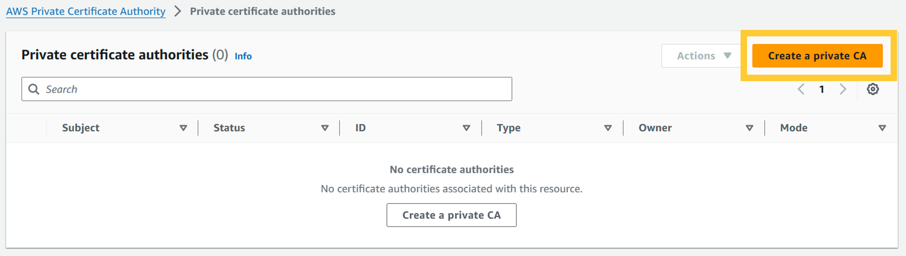
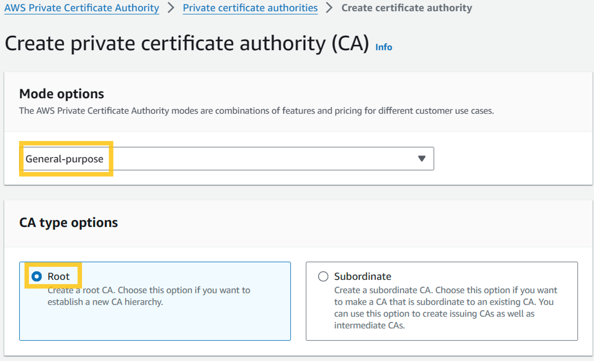
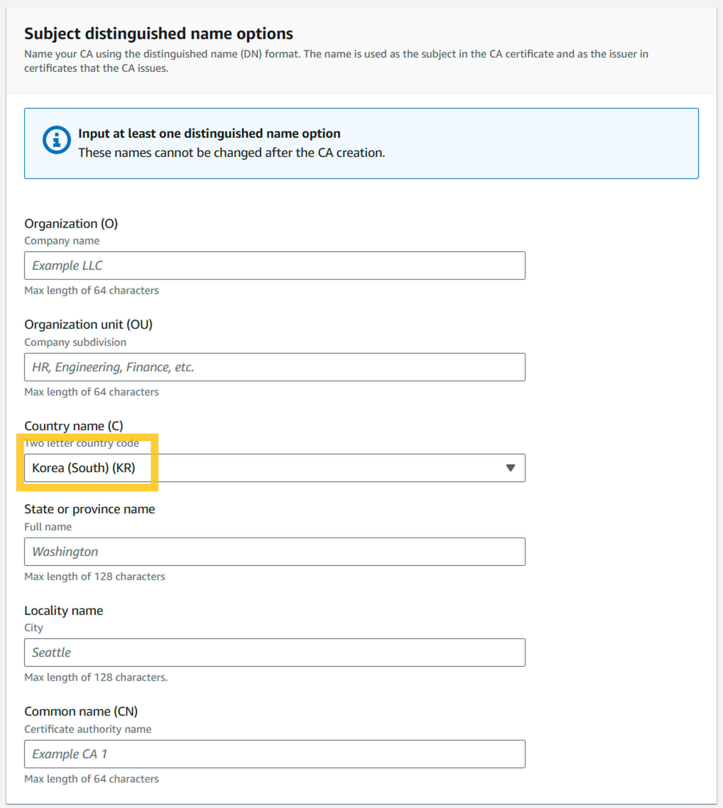
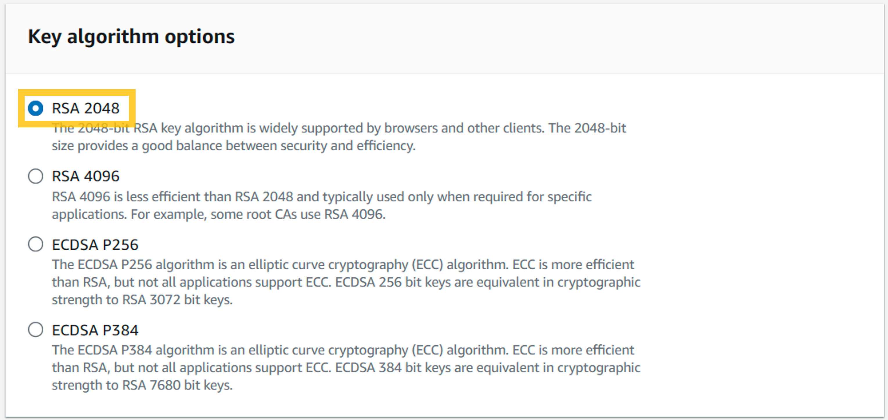

[AWS IAM Roles Anywhere](httphttps://docs.aws.amazon.com/rolesanywhere/latest/userguide/introduction.html)는  AWS 내에서 Role을 이용해서 임시 credential을 사용하는 것과 동일하게, 외부에서도 Role을 이용해서 임시 credential을 이용해서 AWS내의 자원을 사용할 수 있도록 한다. IAM User에 credential을 생성하여 프로그램 환경 변수나 aws CLI config 사용하는 것과 비교 했을 때 보안이 강화된다. 또한, Devfile 과 같은 개발 환경 자동화 도구를 통합하여 개별 개발자가 복잡한 개발환경 설정에서 자유로워 진다.

Roles Anywhere 설정하고 [Dev Environments in CodeCatalyst](https://docs.aws.amazon.com/codecatalyst/latest/userguide/devenvironment.html) 인스턴스에 적용하는 예를 통해서 구현 방법에 대해서 알아본다.

- **전체 흐름**
- **AWS Private Certificate Authority를 이용한 사설 인증서(Private certificate) 발급**

## AWS Private Certificate Authority를 이용한 사설 인증서(Private certificate) 발급

openssl을 이용해서 직접 사설 인증서를 발급하고 IAM > Roles > Roles Anywhere > Create a trust anchor 에서 직접 입력하는 방법도 있지만, 여기서는 사설 인증서를 관리할 수 있는 [AWS Private Certificate Authority](https://docs.aws.amazon.com/privateca/latest/userguide/PcaWelcome.html)를 이용한다. 

먼저 사설 인증서를 발급하기 위해서 CA(인증 기관)을 생성한다.

*AWS Private Certificate Authority > Private certificate authorities*

*Mode: General-purpose | Type: Root*
*CSR*
*algorithm: RSA 2048*
