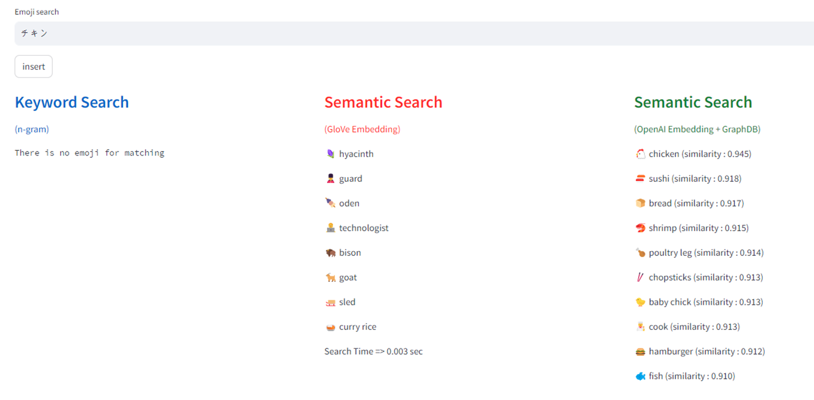

> 이 글에서는 텍스트(자연어) 데이터의 색인(Index) 방식과 활용 방법에 대해서 기술적으로 설명한다. LLM 모델 자체에 대한 기술적인 설명이나, 자연어 처리(NLP)에 대해 구현(implementation) 관점의 상세한 설명은 핵심 주제가 아니다.
> 텍스트 임베딩을 이용한 검색 시스템의 전반적인 설명은 [이전 포스팅](/publication/blog/txt-index-with-vector-embeddings/)에서 다루었다.
> 임베딩을 이용한 벡터 유사도(Vector Similarity) 기반 시맨틱 검색을 이해 하거나, Graph DB를 적용한 검색 기능 고도화에 관심이 있는 소프트웨어 엔지니어에게 도움이 될 것이다.

## Semantic vs. Synthetic

사용자가 자연어를 이용해 필요한 정보를 찾기 위한 기술 중 비교해볼 수 있는 것으로 아래와 같은 두 방식이 있다. 
1. 직접적인 키워드 매칭 을 이용한 Synthetic Search(Keyword Search) 
2. 벡터 유사도 측정(Vector Similarity)을 이용한 Semantic Search

Synthetic Search의 대표적인 예로 n-gram을 기반으로 Full-text search를 지원하는 방식이 있는데, 이는 전문을 일정 단위(n)로 쪼개어 각각의 부분들을 인덱스로 활용하여 검색 정확도를 올리는 방법이다. 웹 브라우저나 일부 프로그램에서 사용하는 Ctrl + f(찾기)기능이 바로 대표적이다. 이는 입력된 검색어의 일치를 검사하기 때문에 높은 정확도의 장점이 있지만, 반대로 그렇기 때문에 검색어 내의 오타 발생이나 잘못된 띄어쓰기 같은 문법적 차이로 기대하는 검색 결과를 얻지 못할 수도 있다. 또한 인덱스 단위 데이터가 별도로 저장되고 정렬되기 때문에 인덱스 데이터베이스의 용량과 변경에 따른 재 정렬 과정에서 부하가 발생하는 단점이 있다.

또한, 데이터의 의미론적 연관성을 반영할 수 없기 때문에 비슷한 의미를 가진 데이터를 찾는 데 어려움이 있을 수 있습니다. 이런 한계를 극복하고 보완하는 방법으로 Vector Similarity를 활용하는 것이 Semantic Search 의 여러 방식 중 하나가 있다. 
Semantic Search는 자연어의 의미론적 요소를 반영하기 때문에 사용자 입장에서 더 풍부한 검색 결과를 제공받을 수 있다. 임베일 기술을 이용해서 단어를 벡터화로 표현하면 유사성을 계산할 수 있으므로 이러한 검색 방식을 구현하는 것이 가능하다. 사용자가 입력한 검색어와 관련된 정보를 더욱 효과적으로 찾을 수 있다. 

먼저 단어를 컴퓨터가 처리할 수 있도록 다차원의 벡터로 변경시키는 Text Embedding이 필요하다.  임베딩 방법이나 벡터 유사도에 대한 설명은 이전 [포스트를](/publication/blog/txt-index-with-vector-embeddings/) 참고하면 된다.

텍스트 임베딩은 (일반적으로) 많은 데이터를 사용하여 모델을 학습시킬 수록 성능이 향상되며, 여러 파라미터/임베딩 차원 등을 조정해야 한다. 직접 임베딩 모델을 구축하고 충분한 양의 데이터를 학습 시키고, 충분한 하드웨어 자원을 이용해서 동작 시키는 일은 기술적 난이도나 비용 면에서 쉬운 일이 아니다. 최근에는 LLM 기반의 서비스들이 제공하는 임베딩 API가 좋은 대안이 될 수 있다. 상용 수준의 서비스를 제공하는 만큼 결과 면에서도 높은 품질을 제공하며, 모델 생성을 위한 학습과 추론에 필요한 하드웨어 자원을 공유하는 모델이기 때문에 사용량 만큼의 합리적인 비용을 기대할 수 있다. OpenAI에서 제공하는 Embedding API도 그 중 하나 이다. API 사용량에 따라 일정 비용(23년 6월 기준 0.0001$/1K token)이 발생한다. 무엇보다 NLP 서비스를 개발하는 초기 단계에서 합리적인 비용과 성능으로 사용할 수 있다. 모델 생성의 자세한 내용은 비공개 이지만, 경우에 따라서는 영어 외 언어에 대해서도 유의미한 결과를 얻을 수 있다는 것은 장점 중 하나 이다. 

하기는 데모 애플리케이션의 동작 모습으로 이모지(Emoji) 데이터를 GloVe 방식으로 twitter 에서 생성된 corpus 를 직접 훈련시켜 개발 환경에서 직접 동작시킨 모델과 OpenAI 의 임베딩 API를 사용하여 각각 입력 검색어에 대해 관련성이 있는 결과를 표시한 것이다.

*demo screenshot*
*demo screenshot*
*demo screenshot*
