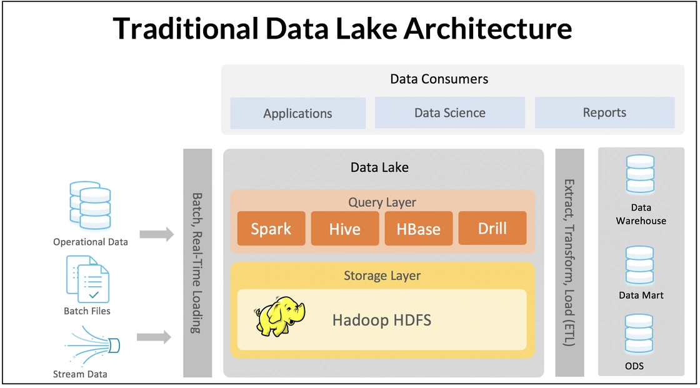
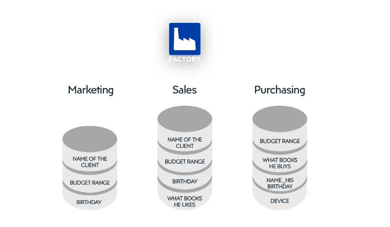
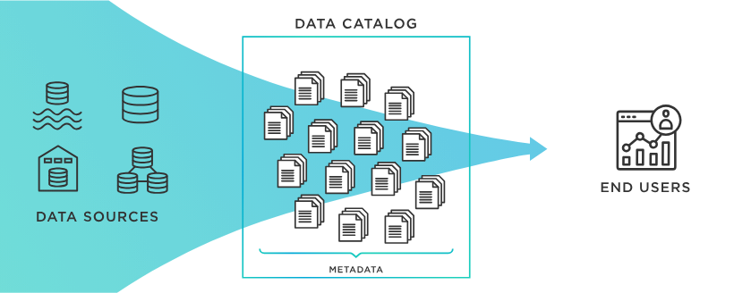

> 본 글은 Data Lake/Data Catalog의 정의, 두 플랫폼 사이의 관계, Data Catalog 사용 장단점, 주요기능에 대해 순차적으로 설명합니다.  
기업에서 데이터 카탈로그를 구축하기 위해 실질적으로 필요한 코드를 기재하거나 데이터 카탈로그의 작동을 위한 테크니컬적인 부분에 대하여 깊게 설명하고 있지 않습니다.   
따라서 해당 글은 사내에 넘치는 데이터를 더 잘 활용하기 위해 Data Lake, Data Catalog 도입을 고민하는 백-엔드, 데이터 엔지니어, 소프트웨어 엔지니어 분들이 읽으시길 추천합니다.   

## 데이터 플랫폼

데이터 플랫폼은 데이터를 활용하고 관리하는데 필요한 기술적 역량을 제공하는 통합 시스템이다. 데이터 플랫폼을 구성하는 컴포넌트는 각각 데이터의 수집, 저장, 전처리, 전송을 지원하고 사용자 혹은 응용 프로그램에 데이터를 제공 한다. 이러한 컴포넌트의 구성과 관계를 사용 목적에 따라 배치하고 정의하면 여러 유형의 시스템을 구축할 수 있다.   
이미 최적화된 데이터 구조에 맞춰 데이터를 통합 수집하고 관리할 수 있는 Data Warehous, Raw 데이터를 1차적으로 통합 관리하고 활용 목적에 따라 필요한 데이터를 탐색 후 가공하는 파이프 라인을 구축한 Data Lakes가 대표적인 사례이다. 그리고 분산 환경에서 데이터에 대한 통합 관리를 가능하게 함으로써 데이터가 가진 잠재적 가치 실현을 지원하기 위한 전략을 내포하고 있는 Data Fabric도 데이터 플랫폼의 한가지 유형이라 할 수 있다.  

이 문서는 데이터 플랫폼에서 Meta Data를 통해서 데이터에 대한 탐색과 처리 효율, 그리고 이력 관리를 지원하는 Data Catalog에 대해 설명한다. 이를 통해 각 컴포넌트에 대해 깊이 이해 하고 데이터 플랫폼 전체에 대한 시스템을 받아들임으로 발생되는 데이터를 이용해 문제를 해결할 수 있는 제대로 된 데이터 플랫폼 시스템을 구축할 수 있을 것이다.  

## Data Lakes 시스템과 Data Catalog

Data Lake란 한 저장공간에 데이터의 형태(정형/반정형/비정형)에 상관없이 전처리를 거치지 않은 raw data형태를 통합 관리하는 특징을 갖는 데이터 플랫폼의 한 종류이다. 기업 환경에서 Data Lake 시스템은 전사에서 발생되는 모든 Data를 비즈니스나 경영 의사 결정에 사용하기 위한 기술 역량을 지원하는 플랫폼이다.  
  
*출처 : [medium - Building Data Lake with Snowflake](https://medium.com/snowflake/building-data-lake-with-snowflake-e003022f1e1f)*

지금은 Web, Application, Mobile, Wareable device, IoT Seneor 등 모든 것들이 계속 인터넷에 연결돼 있으며 log를 포함한 다양한 형태의 많은 데이터가 쌓이고있다. 때문에 회사가 보유할 데이터의 양은 적게는 GB, 크게는 ZB(Zetta byte)까지 방대하게 증가하고 있고 이러한 데이터를 효과적으로 사용하고자 하는 요구가 증가하고 있고 그를 위한 DataLake 플랫폼을 원하고 있다. 
이러한 데이터를 효율적으로 사용하기 위한 플랫폼엔 몇 가지 필요한 조건이 있다.

### 1. 데이터 접근성 확보를 위해 검색 제공

Data Lakes내에 있는 수많은 데이터 중 User의 사용 목적에 부합하는 데이터를 찾아서 활용할 수 있어야 한다. 

각 사내에 있는 Data Scientist나 Data Analyst가 저장되어 있는 모든 데이터를 세세하게 알고 있을 확률은 지극히 낮다. 그렇다면 필요한 데이터를 추출하기위해 Database Administrator나 Data Engineer의 도움을 필요로하게 되는데, 이때 해당 직군의 사람들에게 의존적으로 되고, 이러한 요청이 몰려 DA,DE에서 병목 현상이 발생해 필요한 데이터를 받기까지 긴 시간이 소요 될 수 있다. 그렇게 되면 불필요한 시간을 소모하게 되고, 적기에 필요한 데이터 분석이나 데이터 모델링 작업이 늦춰져 경영자들의 데이터를 기반한 의사 결정(DDDM, Data Driven Decision Making)이 기업 발전에 큰 도움이 되지 못하는 악순환이 벌어질 수도 있다. 

이러한 악영향을 방지하기 위해 데이터 추출 병목이 발생하지 않는 User 친화적인 검색시스템을 구축해야한다. 그러려면 실제 데이터명이 아닌 비지니스용어로 검색해 전사 누구나 쉽게 검색할 수 있는 비지니스 메타데이터를 이용한 검색시스템이 필요하다. 만약 이런 시스템이 갖춰있지 않다면 `car_types`같은 실제 table name이나 column name을 통한 검색이 이뤄져야하는데, 이 같은 이름은 위에 적힌 DBA나 DE 업무를 하고 있는 담당자들이 아니면 정확하게 알기 어렵다. 따라서 `차량 종류` 처럼 실무자가 사용하는 용어로 변경해야할 필요가 있다. 이를 위해서 필요한 것이 비지니스 메타데이터이다. 그리고 이 메타데이터와 데이터 객체를 서로 연결시켜주는 작업이 필요하며, 이를 검색 가능한 형태로 변경해주기 위해 index화 하는 작업이 필요하다.

더 나아가서는 User 검색어에 맞춰 연관된 데이터를 함께 보여주는 추천 Data 시스템을 구축하는 것도 좋은 방법이다.

### 2. Schema를 확인하지 않는 수집 시스템

데이터를 원시 구조(raw data)로 수집하는 Data Lake에서는 다양한 데이터를 빠르고 간편하게 저장하기 위해서 Data Input시 Data의 Schema를 먼저 정의하지 않고 저장하는 `Schema-on-Read` 구조를 따른다.  

수많은 데이터를 저장하는 경우엔 현실적으로 모든 데이터의 Schema를 정의하거나 확인하는 작업을 하기 어렵다. 그래서 먼저 데이터 구조의 정의 없이 빠르게 데이터를 수집하고 Data user의 활용성에 맞춰 적절한 형태로 가공해 사용함으로 Data Lake의 가장 큰 장점인 유연성을 보장한다. 이러한 대량의 Raw Data를 저장하고 빠르게 처리하기 위해서 다수의 컴퓨터를 활용하는 기술을 Hadoop system이라 하고, 이런 하둡분산파일시스템(HDFS)은 Schema-on-Read 구조에서 빼놓을 수 없는 기술이다.
  
*출처 : [Redis blog-Understanding Topology-Based Data Architectures](https://redis.com/blog/understanding-topology-based-data-architectures/)*

이와 반대되는 개념으로 `Schema-on-write` 구조가 있다. 이는 데이터를 저장할 때 Schema가 정의되어 있고, 이를 기반으로 데이터를 모델링하고 저장하며 추후 데이터를 활용할 때도 schema를 기준으로 읽고 활용하는 것을 의미한다. 주로 Data Warehouse의 단계에서 이런 구조를 바탕으로 데이터를 저장/읽기를 하게 된다. 이렇게 하면 저장 데이터의 구조와 속성이 고정되어있기에 정돈되고 퀄리티가 보장된 데이터를 얻을 수 있어 한 번의 변환으로 많은 데이터를 사용할 수 있다는 장점이 있다. 

하지만 저장시 시간이 많이 소요되고 구조화된 데이터만 저장되기 때문에 다양한 형태의 데이터를 저장할 수 없다. 또한 설계가 유연하지 못하며, 가장 중요한 단점으로 수집하기 전 발생되는 모든 데이터의 구조를 먼저 정의하는 것은 현실적으로 어려움이 있어 Data Lake에 `Schema-on-write` 구조는 적절하지 않다. 

따라서 대용량 저장소인 Data Lake에선 데이터 schema에 상관없이 데이터를 용이하게 저장하며 데이터 형태의 구애없이 빠르게 저장하고, 그로인해 스트리밍 데이터까지 처리할 수 있게 된다. 또한 `Scale Out` Architecture를 이용해 데이터의 용량이 증가하는 것에 맞춰 저장소의 볼륨을 조절할 수 있는 확장성도 갖게 된다.

  
*출처 : [ETL(Data Warehouse) vs ELT(Data Lake) : 5 Critical Differences](https://www.integrate.io/blog/etl-vs-elt/)*

### 3. 데이터 분석을 위한 환경 구성 및 연계 시스템

데이터 분석을 위해선 먼저 모든 구성원이 전사의 전체 데이터구성을 확인할 수 있어야한다. Data Lake를 사용하는 이점 중 하나가 Data Silo가 만들어지지 않아 전사 조직이 통합된 데이터를 볼 수 있다는 것이다. Data Lake이전의 상황에선, 각 부서/조직별로 데이터셋을 만들 경우 필요 데이터를 따로 적재하고 관리하면 다른 조직과 Data Silo가 발생할 수 있다. 예를 들어 A팀에서 모으는 데이터를 B팀에서 다른 이름으로 중복 저장하거나, 전체적인 회사의 고객 판매실적을 공유해야하는 영업과 회계팀이 팀별 Data Base를 다르게 사용하여 하나의 프로세스로 전반적인 회사 상황을 처리는 것이 불가능해지는 경우가 있다. 이렇게 각 담당 부서/조직간 표준시스템의 부족, 통합 프로세스 실패 등의 이유로 발생하는 데이터 일관성 저해를 데이터 사일로(Data Silo)라 한다. 

  
*출처 : [What is a data silo and why is it bad for your organization?](https://factory.dev/pimcore-knowledge-base/whitepaper/data-silos)*

이런 데이터 사일로로 인한 문제점은 아래와 같다

- 데이터의 중복 입력으로 이어져 운영 비용이 증가하고, 조직의 경계를 넘나들며 작업하는 팀에서 데이터를 공유하기가 까다로워짐
- 엔지니어와 분석가들이 데이터에 대해 포괄적인 관점을 확보하는 데 방해가 되어 처리 결과가 불확실하게 됨
- 부실한 의사 결정과 기회의 손실로 이어짐
- 지속되면 시스템 관리 및 제어를 위한 소프트웨어 라이선싱, 모니터링 및 유지관리를 위한 전담 IT 전문가 등이 필요하여 운영 비용이 상승함
- 기업에서 시장의 변화나 고객의 요구 사항에 빠르게 대응하는 데 어려움을 겪어 민첩성이 저하되거나 소비자 행동의 변화 또는 경쟁 상황에 실시간으로 대응하는 역량이 제한될 수 있음
    - 출처 : 데이터 사일로란?(https://www.hpe.com/kr/ko/what-is/data-silos.html)

그래서 전사의 모든 데이터를 Raw형태로 DataLake 한 저장소에 저장해야하고, User가 필요로 하는 데이터를 소속 구분없이 자유롭게 사용할 수 있는 환경을 만들어야한다. 다만, 데이터 개방성(Openness)을 위해 접근성을 높이되, 수집된 데이터 중 정보보호나 다른 특정 사유를 이유로 전체를 보여주지 않고 일부를 가리는 마스킹(난독화 처리, Masking) 기능이 필요하다. 특히 금융권처럼 중요한 개인정보를 강하게 관리해야하는 도메인에선 데이터 마스킹에대한 관심이 높고 데이터를 Load/Extract 할 때 해당 데이터를 다른 값으로 처리하거나 해당 column에 대한 접근을 통제하는 기술이 필수적이다.

또한 대용량 데이터 분석을 위해 성능을 충분히 뒷받침할 수 있는 기술이 필요하다. 데이터는 시간에 따라 계속해서 증가하기 때문에 분석시 사용하는 용량(대부분 3~5년치)은 TB(TeraByte)이상의 대용량이 된다. 대용량 데이터를 다루는 가장 이상적인 방법은 고성능의 대용량 서버를 사용하여 처리하는 것이나, 이러한 방법으로는 얼마못가 어마어마한 비용적 문제에 직면하게 된다. 그 때문에 대안으로 나온 것이 Hadoop 분산 처리 기술(Hadoop Distributed File System, HDFS)이다. Hadoop(High-Availability Distributed Object-Oriented Platform)은 상대적인 저비용 서버를 여러대 사용하여 대용량의 데이터를 처리하기 위한 서비스로, 하둡 생태계의 서비스들을 공통 패키지로 구성해 사용한다. 

그리고 최근엔 직접 Hardware 구축이나 Infra Structure 운영을 하지않아 간편하고, 사용량에 따른 비용청구가 되는 Public Cloud환경에서 DataLake를 구축하는 추세이다. 또한 구축의 용이성 뿐만아니라 Cloud Service인 Identity and Access Management (IAM)을 이용하여 각 Object Storage의 권한관리도 쉽게 할 수 있어 Data Governance가 간편하다는 장점이 있다. 실제 사용되고 있는 예시로는 AWS(Amazon Web Service)의 S3를 이용한 AWS Lake Formation, Google의 Cloud Strorage를 이용한 Data Lake, Microsoft의 Data Lake Storage를 이용한 Azure Data Lake 등이 있고 기업에서 주로 사용되고 있다.

더불어 데이터 분석을 위해 필요한 조건은 분석 Tool과의 연계성이다. 

Data Lake에 적재되어 있는 수많은 데이터를 기반으로 비지니스 의사결정을 하기 위해선 빠르고 쉽게 의사결정을 내릴 수 있는 BI 대시보드 같은 Tool이 필요하다. User는 Data Lake에서 원하는 Source를 받아 전처리 작업을 진행한 후 데이터를 시각화하고 다각도로 표현하여 원하는 결과를 도출한다. 이럴때 Jupyter Notebook 같은 대화식 쿼리 서비스와 Tableau, PowerBI, Redash 같은 BI Tool을 사용한다. 이때 Raw Data를 얼마나 빠르게 User Computing 환경으로 가져올 수 있는지도 DataLake의 중요 조건 중 하나이다. 

## Data Lake 시스템에서 Data Catalog의 역할

데이터의 증가 속도와 축적되고 있는 데이터의 볼륨은 일반적인 기대를 뛰어 넘는 수준이다. 소셜 네트워크 사이트(SNS) 중 하나인 Facebook은 Raconteur社에 따르면 하루에 4PB(2020년 기준)를 생성한다고 하며, 2025엔 하루에 463 ZB가 생성될 것이라고 예상한다. 이처럼 회사가 보유하는 데이터는 점점 더 방대하게 증가하고 있다. 

  
*출처 : [53 Important Statistics About How Much Data Is Created Every Day](https://financesonline.com/how-much-data-is-created-every-day/)*

이렇게 많은 데이터를 담고 있는 DataLake의 Raw데이터를 효과적으로 다루기 위해서 필요한 것이 바로 Data Catalog이다. 

  
*출처 : [TIBCO What is a Data Catalog?](https://tibco.com/reference-center/what-is-a-data-catalog)*

Data Catalog는 사내에 존재하고 있는 데이터를 빠르게 찾을 수 있도록 하는 데이터 소스 연결고리 역할을 하는 서비스이다. Data Catalog란 이름에 있는 것 처럼 Catalog의 속성을 생각해보면 Data Catalog를 쉽게 이해할 수 있다. 
Shopping Catalog는 Catalog 제조업체가 수 많은 판매 제품 하나하나의 정보를 한 페이지에 모아 각 제품의 브랜드/제조사/이름/이미지 등의 속성을 관리하여 일반 구매자에게 제공한다. 이를 통해 구매자는 제조업체나 카테고리에 제한되지 않고 구매자가 검색을 통해 원하는 제품을 찾고 구매할 수 있게 된다. Data Catalog도 마찬가지다. 

Data Catalog는 데이터의 정보가 담겨져 있는 메타데이터를 관리하여 User에게 출처, 형식, 속성 등을 확인할 수 있도록 제공한다. DataLake에 있는 데이터를 User가 쉽게 검색하고 데이터의 정보를 확인하며 나아가 다운로드까지 할 수 있기 때문에 Data Catalog를 데이터 전달 플랫폼(Data Delivery Platform, DDP)의 요소로 보기도 한다. 

Data Catalog의 역할은 여기서 멈추지 않고, 데이터가 회사의 자산으로 활용될 수 있도록 돕는다. “데이터가 아마존에서 왕(Data is king at Amazon)”이라는 말이 있을 정도로 이러한 데이터들은 개인들의 기록임과 동시에 회사의 입장에서는 각 고객들의 사용 흔적이며 이는 고객 맞춤형 서비스를 제공하기 위한 자산이다. 특히 최근엔 쿠키 값을 통해 각 사용자 별 데이터를 특정해서 모을 수 있으며 해당 데이터들을 통해 사용자의 과거 행동기반으로 유저가 관심을 가질만한 콘텐츠들을 추천하며 적합한 콘텐츠를 제공할 수 있다. 해당 방법은 Amazon, Meta, Coupang, 등 이미 많은 기업에서 사용하며 유저별로 다른 광고를 하며 수익을 올리고 있다. Amazon 구매 중 35%의 제품은 Amazon이 추천한 제품을 구매한다고 하니 유저의 편의성뿐만 아니라 기업의 매출 향상에도 큰 기여를 하고 있음을 알 수 있다. 

이렇게 데이터를 자산으로써 활용하려면 Raw Data 그자체로는 큰 도움을 줄 수 없다. 이 Raw Data사이에서 User가 올바른 데이터를 찾고 사용할 수 있도록 User에게 데이터의 설명이나 속성, 데이터 리니지(계보), 등을 제공해야 한다. 이러한 전체적인 작업은 Data Catalog가 제공하는 프로세스 안에서 자동화되어 진행 되어야한다. 

먼저, Data Pipeline을 통해 데이터를 수집하고, 카탈로그의 Agent를 통해 데이터의 Column이나 field를 확인해 Meta Data를 생성한다. 그리고 추가적으로 데이터의 Lineage를 구축하고 Data Profiling을 진행하며 데이터의 품질을 향상 시킨다. 이후 직접 사용하는 User를 통해 각 데이터에대한 설명과 태그정보를 수정하거나 사용자의 평가 및 리뷰를 통해 데이터를 자산화 한다. 

이러한 작업들을 통해 데이터가 자산화 되며 활용성이 늘어나기 때문에 기업의 데이터 활용 역량과 Data Catalog 기술의 수준은 밀접한 관련이 있으며, 그에 따라 Data Catalog의 중요성은 더욱 커질 것으로 예상된다.

### Data Fabric에서의 Data Catalog

데이터의 탐색 가능 역량은 다양한 유형의 Data Platform 시스템에서 공통적으로 요구된다. 앞서 Data Lakes 시스템 에서도 Data Catalog가 비즈니스 목적이 부합하도록 효과적인 방법으로 데이터 검색을 지원하는 것과 같은 맥락에서 Data Fabric 시스템에서도 Data Catalog는 핵심적인 요소 기술로 한층 더 강조된다.

Data Fabric의 특성 중 Data Lakes와 구분되는 것 중 하나는 분산 데이터 환경을 지원한다는 점이다. 때문에 Data Catalog와 직접 관련이 있는 고도화 된 Metadata 관리 기술이 필요하다. Data Lakes에서 통합 저장소에 원천 데이터를 수집하고 일관된 방법으로 데이터를 처리할 수 있는 것과 비교 했을 때, 상대적으로 분산 환경에서 효과적인 관리 방법을 구축하고 운영하는 것은 복잡도가 증가할 수 밖에 없다. 이러한 문제를 다루기 위해 도입된 기술 개념을 Active Metadata 관리라 하며, Data Fabric 시스템에서 핵심 정인 요소 기술 중 하나 이다.

또한, 분산 데이터 시스템의 특성에 따라 데이터의 구조, 스키마 정의에 사용하는 용어, Metadata 등을 표현할 때 사용하는 용어를 특정 형태로 통일해서 관리하는 것이 어렵다. 원천 데이터 소스 시스템 개별적으로 사용하는 용어가 다를 수 있기 때문이다. Data Catalog도 동일한 이유에서 의미론적 확장의 개념으로 Knowledge Catalog라는 기술 개념으로 발전한다.

Active Metadata 관리에서 중요한 것 중 하나는 분산 환경의 데이터 소스에서 발생하는 변경을 추적하고 반영하는 것이다. Data Lakes나 Data Warehouse와 같은 데이터 플랫폼 시스템은 중앙 집중식 저장소 구조를 갖고 있기 때문에, 여기서 축적된 기술을 Data Fabric 시스템에 그대로 적용하는 것은 어렵다. 

Active Metadata 관리 체계에 대한 구조적 접근은 크게 두 가지로 볼 수 있다. 1)개별 데이터 소스를 작은 단위의 Data Platform 시스템 형태(ex. Data Product)로 구축하고 Metadata의 관리를 각각의 시스템이 독립적으로 운영 하면서 필요한 다른 Data Product 를 통합할 수 있는 Mesh 구조가 그 중 하나 이고, 다른 하나는 2)Metadata 관리에 대한 책임은 중앙 집중식을 유지 하면서 필요에 따라 동적으로 분산 된 데이터 소스와 커뮤니케이션 하면서 동작하는 Fabric 구조이다.

Metadata 관리에 대한 기술적인 기초가 마련 됐다면, Data Catalog에 대해 이야기 해 볼 수 있다. 분산형 시스템의 구조적인 특징이 Data Catalog 요소 기술에도 영향을 미친다. 중앙 집중식 시스템에서는 Metadata의 분석이나 재-가공 등에서 일관된 규칙 등을 적용해서 정의한 관리 체계에 부합하는 시스템을 구현할 수 있었다. 분산 데이터 환경에서 동적으로 데이터를 통합할 수 있는 역량이 필요한 Data Fabric의 경우 더 진화 된 형태의 지능형(Intelligent) Data Catalog 시스템이 필요하다. 기존의 Data Catalog가 기호와 용어를 일관되게 관리하고 전체 시스템에 적용하는 방식이라고 한다면, Data Fabric 시스템에서 Data Catalog는 도메인 전문 지식과 자연어 처리에 대한 역량이 통합돼 보다 효과적인 방식의 동적 데이터 통합을 지원해야 한다. 이를 Knowledge Catalog라는 용어로 표현하기도 한다.

## 요약 및 결론(Key Takeaways)

Data Platform은 데이터들을 통합 관리하기 위한 컴포넌트들의 집합체로 빅데이터를 효율적으로 자산화하기 위해서는 필수적으로 구축해야한다. 

그 중 이번 글에서 언급하고 있는 Data Lake는 데이터 자산화를 위해 먼저 데이터를 수집하는 방법에 대해 이야기했다. 빠른 데이터 Load를 위해 schema-on-read 사용, 수집된 데이터에 용이하게 접근하기 위한 검색서비스, 접근한 데이터의 분석을 위한 환경 구성 및 Tool 연계성의 중요성을 제시하였다. 그 결과로 유저는 Data Silo 없이 곳곳에 흩어진 데이터를 Data Platform 한 곳에서 통합 관리할 수 있게 된다. 

그리고 글에서 언급한 또 다른 Data Platform 컴포넌트는 Data Catalog로, 이는 Metadata를 이용해 Data Lake에 있는 대규모 데이터를 체계적으로 관리하고 효율적으로 활용하기 위해 필요한 핵심 기술 중 하나이다. Data Catalog를 통해 유저는 Data Engineer나 Data Base Administrator의 도움 없이도 손쉽게 원하는 데이터를 찾고 사용할 수 있게 됨으로 높은 활용성을 갖게된다. 이로써 조직은 데이터를 보다 효과적으로 관리하고, 비즈니스 의사결정을 위한 가치 있는 인사이트를 뽑아낼 수 있게 되어 데이터 자산화를 이룬다.

Metadata는 데이터의 전반적인 상태를 나타낼 뿐만아니라 이를 통해 실제 데이터를 직접 다운받지않고도 접속해 확인할 수 있는 데이터 가상화를 만들어내는 데에도 핵심 역할을 하기 때문에 이 Metadata 관리는 Data Catalog 제작에 있어 중요한 부분이다. 나아가 Data Fabric에서는 분산 구조의 특성에 따라서 동적 데이터 통합을 할 수 있는 지능형 Data Catalog가 요구되며, 이를 위해 Metadata 관리 또한 Active Metadata 관리라는 기존보다 진보된 기술이 필요하다.